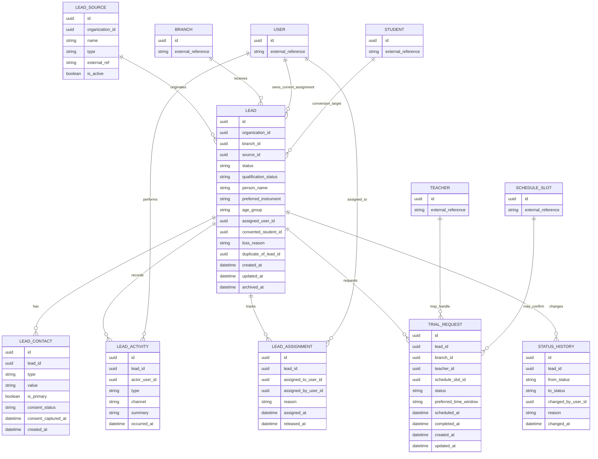

# Lead Center ER Diagram

## Status

This is a conceptual ER diagram for the Lead Center module.

It is not a physical database schema and does not select a database technology.

```mermaid
erDiagram
    LEAD_SOURCE ||--o{ LEAD : originates
    BRANCH ||--o{ LEAD : receives
    USER ||--o{ LEAD : owns_current_assignment
    LEAD ||--o{ LEAD_CONTACT : has
    LEAD ||--o{ LEAD_ACTIVITY : records
    LEAD ||--o{ LEAD_ASSIGNMENT : tracks
    LEAD ||--o{ TRIAL_REQUEST : requests
    LEAD ||--o{ STATUS_HISTORY : changes
    USER ||--o{ LEAD_ASSIGNMENT : assigned_to
    USER ||--o{ LEAD_ACTIVITY : performs
    TEACHER ||--o{ TRIAL_REQUEST : may_handle
    SCHEDULE_SLOT ||--o{ TRIAL_REQUEST : may_confirm
    STUDENT ||--o{ LEAD : conversion_target

    LEAD {
        uuid id
        uuid organization_id
        uuid branch_id
        uuid source_id
        string status
        string qualification_status
        string person_name
        string preferred_instrument
        string age_group
        uuid assigned_user_id
        uuid converted_student_id
        string loss_reason
        uuid duplicate_of_lead_id
        datetime created_at
        datetime updated_at
        datetime archived_at
    }

    LEAD_CONTACT {
        uuid id
        uuid lead_id
        string type
        string value
        boolean is_primary
        string consent_status
        datetime consent_captured_at
        datetime created_at
    }

    LEAD_SOURCE {
        uuid id
        uuid organization_id
        string name
        string type
        string external_ref
        boolean is_active
    }

    LEAD_ACTIVITY {
        uuid id
        uuid lead_id
        uuid actor_user_id
        string type
        string channel
        string summary
        datetime occurred_at
    }

    LEAD_ASSIGNMENT {
        uuid id
        uuid lead_id
        uuid assigned_to_user_id
        uuid assigned_by_user_id
        string reason
        datetime assigned_at
        datetime released_at
    }

    TRIAL_REQUEST {
        uuid id
        uuid lead_id
        uuid branch_id
        uuid teacher_id
        uuid schedule_slot_id
        string status
        string preferred_time_window
        datetime scheduled_at
        datetime completed_at
        datetime created_at
        datetime updated_at
    }

    STATUS_HISTORY {
        uuid id
        uuid lead_id
        string from_status
        string to_status
        uuid changed_by_user_id
        string reason
        datetime changed_at
    }

    BRANCH {
        uuid id
        string external_reference
    }

    USER {
        uuid id
        string external_reference
    }

    TEACHER {
        uuid id
        string external_reference
    }

    SCHEDULE_SLOT {
        uuid id
        string external_reference
    }

    STUDENT {
        uuid id
        string external_reference
    }
```

